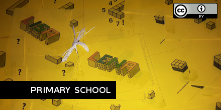

Cubes
=====

Download:

- [Cubes with name Lena (PDF)](003-Cubes-Lena.pdf)
- [Cubes with name Lisa (PDF)](003-Cubes-Lisa.pdf)
- [Source files](https://github.com/adibaba/learning-material/tree/master/math/cubes/)

About (German)
--------------

- Thema: Räumliches Vorstellungsvermögen und Einheitswürfel
- Ein Heftchen zum angeleiteten Üben und Lernen 
- Motivation durch Darstellung des eigenen Namens "Aus wie vielen Würfeln besteht dein Name?"
- Schrittweiser Aufbau: Würfel zählen, Dimensionen nacheinander aufbauend, Kurzaufgaben mit Lösungsvorschlägen 
- Zählen, Summieren oder einfache Multiplikation
- Abschließendes Zusammenzählen aller Kästchen (wenn Zwischenergebnisse notiert)
- Grafiken erstellt mit [Inkscape](https://inkscape.org/)

License
-------

This work is licensed under the Creative Commons Attribution 4.0 International License. To view a copy of this license, visit
http://creativecommons.org/licenses/by/4.0/ or send a letter to Creative Commons, PO Box 1866, Mountain View, CA 94042, USA.

Author: Adrian Wilke
https://github.com/adibaba/learning-material/tree/master/math/cubes/
